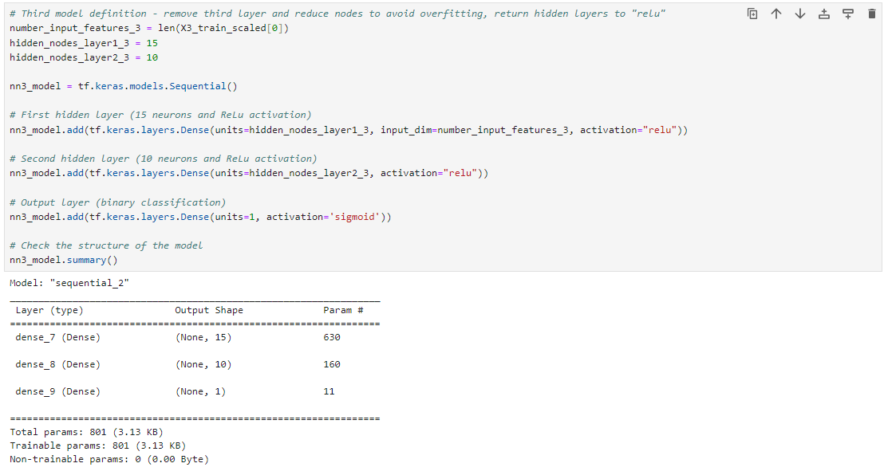

# Neural Network Model Report

## Overview

#### The purpose of performing the analysis in this project was to create a predictive tool for Alphabet Soup that helps identify which funding applicants are most likely to succeed with the financial support they receive. Using historical data on funded organizations, the goal was to develop a machine learning model that accurately predicts the success of future applicants. This predictive capability would allow Alphabet Soup to improve the efficiency and effectiveness of funding decisions, ensuring that resources are allocated to the organizations with the highest potential for successful outcomes.

## Results

### Data Preprocessing:
#### 1. The target variable for the model is the outcome of the project that was funded, represented by the "IS_SUCCESSFUL" column in the dataset. Successful outcomes are identified by an entry = 1, unsuccessful outcomes are identified by an entry = 0. 
#### 2. The feature variables for this model are all other data entries, not included in the "IS_SUCCESSFUL" column. These include:
####    * APPLICATION TYPE
####    * AFFILIATION
####    * CLASSIFICATION
####    * USE CASE
####    * ORGANIZATION
####    * STATUS
####    * INCOME AMOUNT
####    * SPECIAL CONSIDERATIONS
####    * ASK AMOUNT
#### 3. The variables for this model that are neither targets nor features, and should therefore be removed from the data input are:  
####    * EIN
####    * NAME

### Compiling, Training, and Evaluating the Model:
#### 1. The initial model included two layers. The first layer has 30 neurons, the second layer had 10 neurons. The activation functions for both hidden layers, as well as the output layer were set as "ReLu". 

#### The original decision for the high number of neurons was based on the high number of columns (44) possible after utilizing the "get dummies" function provided in the guidance starter code. The majority of the examples provided during class were successful with two hidden layers, hence the initial decision to remain as two layers for this model. In visual modeling tools provided in class(TensorFlow Playground), ReLu seemed to provide greater flexibility in determining adequately separated populations for the output. 

#### 2. The initial model was close, but fell short of the target model performance: 72.5% (actual) vs 75% (target).

#### 3. Three attempts were made to imprive performance of the model.
#### * First optimization attempt: increase the number of nodes and change output activation to Sigmoid. This model did not change the accuracy, which remained at 72.5%.

#### * Second optimization attempt: return to the original number of nodes (30 and 10), add an third layer (also 30 modes), and change all activations to Signmoid. This model did not effectively change the accuracy, which resulted as 72.6%.

#### * Third optimization attempt: return to the original two layers, reduce the number of nodes to 15 and 10, and return hidden layer activations to ReLu. These changes were made to determine if previous models were expereiencing "overfitting." This model did not effectively change the accuracy, which resulted as 72.8%.

## Summary

#### The initial neural network model, which included two hidden layers with 30 and 10 neurons respectively, and used ReLU activation functions, achieved an accuracy of 72.5%. This was slightly below the target accuracy of 75%. Despite several optimization attempts, the highest accuracy achieved was 72.8%. The adjustments made included varying the number of neurons, changing activation functions, and experimenting with additional hidden layers. At this time, the model does not demonstrate an acceptble predictive performance in identifying which applicants for funding are most likely to succeed with the financial support they receive.

#### If additional evalaution was warranted for this neural network model, next steps could included revisiting the input data to determine if the inclusion of the originally excluded "EIN" and "NAME" columns should be included as features, and/or to determine if other features could be exlcuded to improve accuracy. Outside of the current neural network model design, it might be advantageous to make use of a different modeling method for this dataset (for example: Random Forest), or to combine models (for example: Random Forest with Gradient Boosting Machines) to improve predictive performance. These methods are adept at handling both categorical and numeric data, and may prove more effective in dealing with unbalanced datasets such as this one.